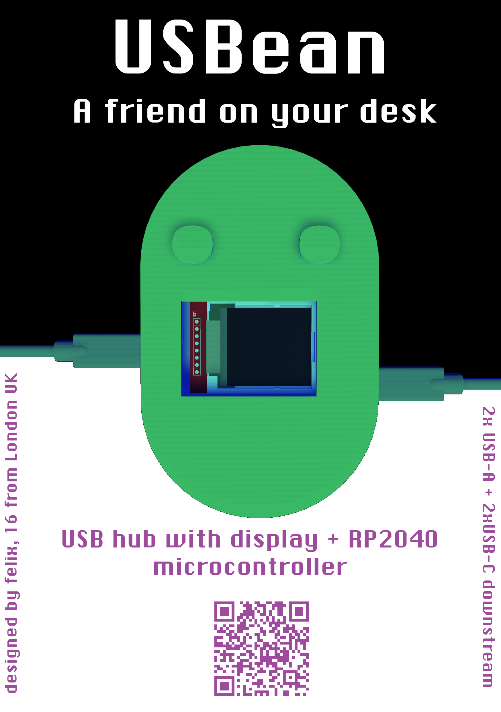
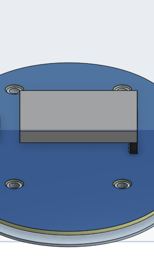
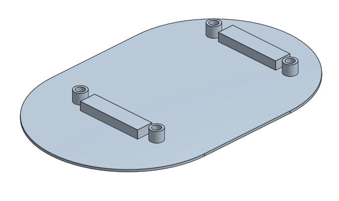
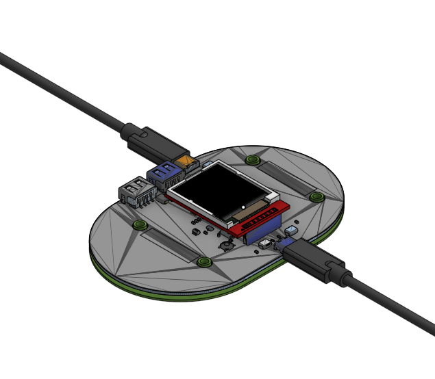
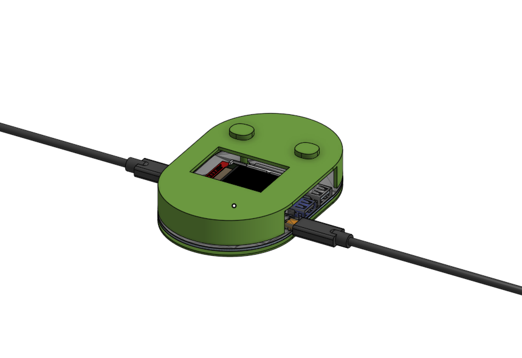
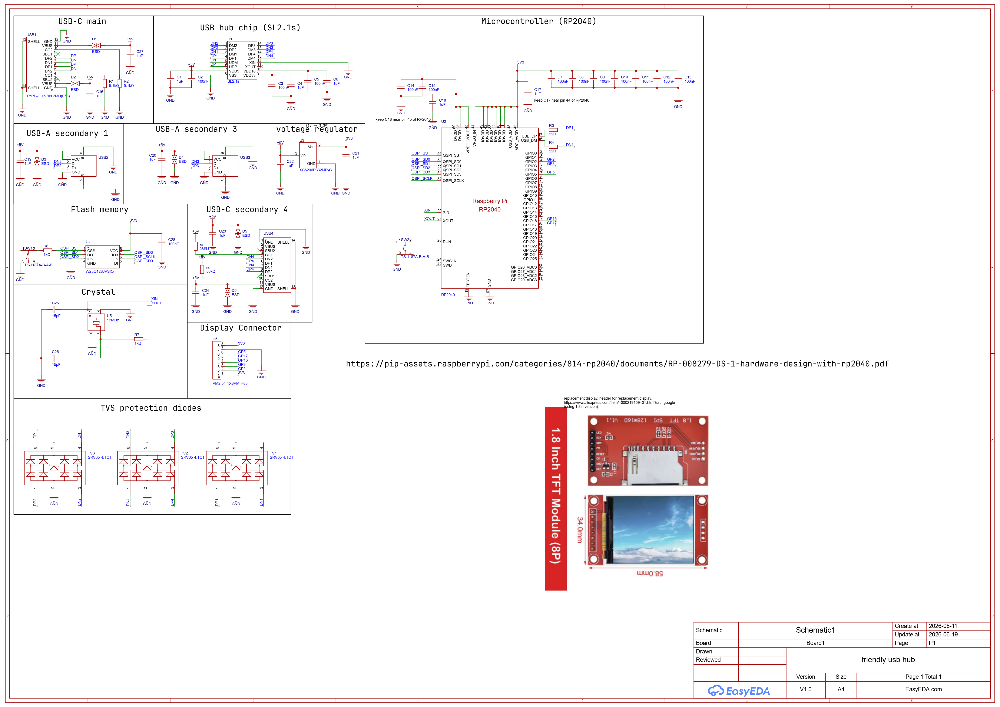
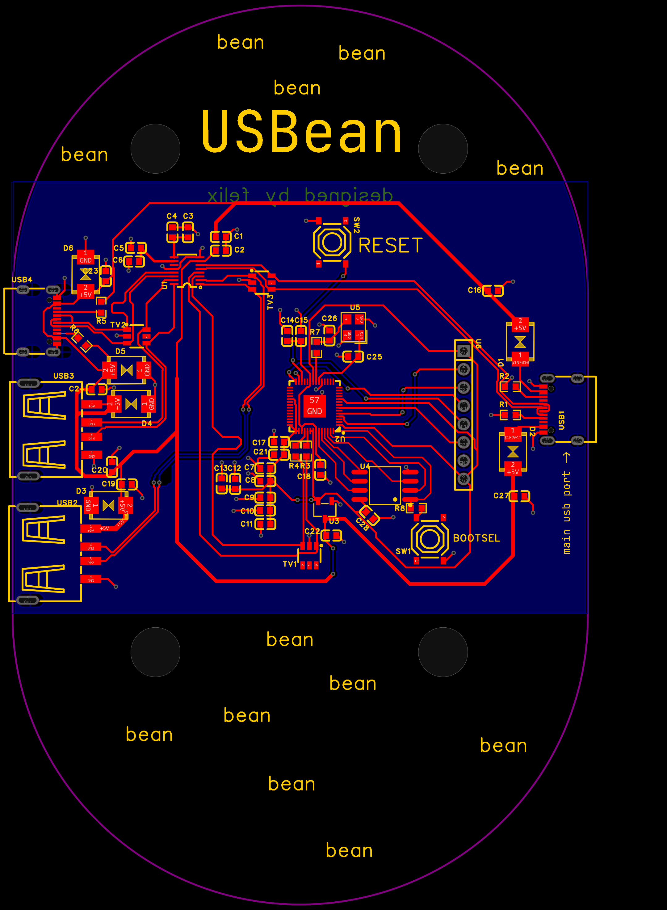

# USBean

A bean-shaped USB hub with a display and RP2040 microcontroller, to provide some friendly motivation, tips, or simply the time or other ambient data, while helping you to organise your desk. 

I made this since I've always struggled with organising cables for peripherals on my desk, and also thought having a simple second display is really useful for displaying data, like a timer or friendly motivational messages, without interrupting the important tasks on the main display. It's a bean because beans are both our friends and very useful to us, just like this will be. 

## Features

- Connect to your host device using USB-C
- 3x USB ports for secondary devices (2x USB-A, 1x USB-C)
- USB 2.0 data speeds
- Protection from electro-static discharge to keep devices safe
- Programmable RP2040 microcontroller (16MB flash) linked to your device
- Simple and light 3D-printed case - 2-part assembly with no screws
- 1.8in colour display for text and graphics

## Assembly

Assemble the PCB or use a PCBA service like JLCPCB (recommended due to small part sizes especially for RP2040).

Insert the display module into the PCB's header, ensuring the display is pointing inwards so sits above the PCB, instead of jutting out from the PCB. If it is aligned wrong, it will not function as expected and could break.

Use the bottom piece (image below) as the base, and align the mounting holes with the bottom piece. It only fits in one orientation, so make sure the PCB is not jutting out of the edges of the case.

Correct positioning onto bottom piece:

Flash MicroPython onto the Pi Pico by plugging your computer into the USB port marked as 'main USB port' on the PCB. [This guide](https://www.digikey.co.uk/en/maker/projects/raspberry-pi-pico-and-rp2040-micropython-part-1-blink/58b3c31ac93649849b58824caa00529c) is helpful in explaining how to flash it - you can use the BOOTSEL button on this PCB just as you do the BOOTSEL button on the Pi Pico.

Once the software is configured, lower the remaining 3D printed piece into the holes through the PCB, ensuring it is aligned so that it does not jut out of the edge of the case either.

Plug in your peripherals using the USB ports on the other side, and you're good to go!

Completed build:

## Software

Note: the code for this has not been fully tested on the hardware, so unexpected behaviour is possible, but this does not affect the USB hub functionality, only the smart display.

Use the MicroPython tools to flash the code in software/microcontroller onto the RP2040 chip (once micropython has been flashed onto the chip, see 'Assembly'). This [guide](https://pip-assets.raspberrypi.com/categories/610-raspberry-pi-pico/documents/RP-008355-DS-1-raspberry-pi-pico-python-sdk.pdf) explains how to flash it and is also generally useful for understanding how to use the microcontroller with Python. Run the pi-messenger.py script on your computer connected to the USBean via USB (connected to the main USB port, on the side with only one usb-c port), and, all going well, it should establish communications and enable you to use functions like the timer, or write your own!!

## Design decisions

The case doesn't fully protect the PCB from the outside to provide extra clearance so that weird devices can still fit into the USB ports, and also to expose the PCB to the user because I think it looks cool. The mechanism for seperating the parts of the case means it could fall apart if the case is aggressively shaken in the vertical direction, but since it is meant as a desk-top device, I think this is okay, and the trade-off means it can have fewer parts, making it cheaper, and it is very easy to assemble and disassemble, so overall I think it is worthwhile.

## Reviewing or editing notes

- Access the 3D assembly files on [OnShape](https://cad.onshape.com/documents/80b4cd38b52a4e1c99c47e9f/w/17e039e92c67e43612d5fe93/e/d8b3fe0a87e4e6a6eee19e1b?renderMode=0&uiState=6a35cc0d2e90be76045e320c)

## Design details

Schematic:

PCB:

## Acknowledgements

 - [Hack Club USB hub tutorial](https://fallout.hackclub.com/docs/guided-projects/usb-hub)
 - [RP2040 design reference](https://pip-assets.raspberrypi.com/categories/814-rp2040/documents/RP-008279-DS-1-hardware-design-with-rp2040.pdf)
 - [ST7735 python lib](https://github.com/boochow/MicroPython-ST7735)